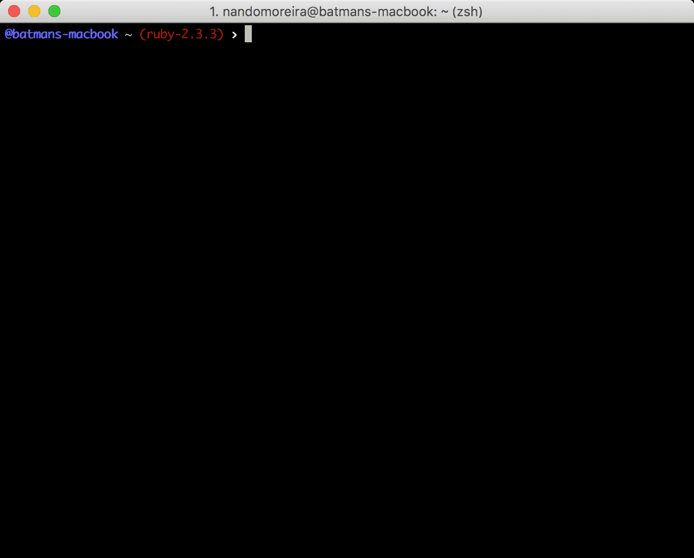

# umdevux

> Fernando Moreira, the person.



```sh
npm install umdevux
```

and

```js
console.log(require('umdevux'));
```

To get my contact information.

## Credits

Thanks to [fdaciuk](fdaciuk/fdaciuk) for the ideia!

## License

[MIT](/LICENSE.md) &copy; Fernando Moreira